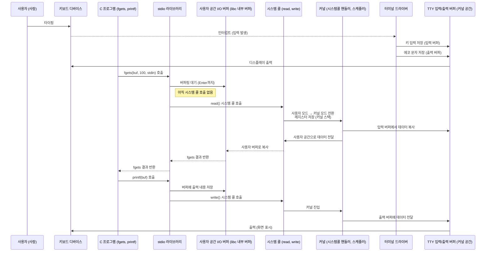

# 10장: 애플리케이션 프로그래밍과 시스템 프로그래밍

터미널은 I/O 장치이며, 사용자 프로그램은 직접 I/O 장치와 통신하지 않는다 (OS가 중간에서 통신을 중재)

#### Context Switch
- 한 프로그램을 다른 프로그램으로 변경할 때 프로세스 컨텍스트를 저장, 복구해야 한다.
  - CPU 레지스터, MMU 레지스터, I/O 상태 등
- 문맥 전환은 비용이 큼 (컨텍스트 저장, 커널 스택 포인터 변경, TLB 플러시, 스케줄러호출, IPC...)
- 사용자 프로그램이 입력 대기(read syscall) 중일 때, 입력이 없으면 CPU를 점유한 채 기다릴 수 없으므로 OS는 해당 프로세스를 sleep 시킴
- 다른 실행 가능한 프로세스에게 CPU를 할당(스케줄링)하면서 컨텍스트 스위칭 발생

 
#### 터미널 장치 드라이버와 버퍼링
- 장치드라이버는 터미널에 들어오는 문자를 장치 드라이버는 입력 버퍼에 키 입력을 저장하고, 입력이 완료될 때(Enter)까지 대기
- 동시에 출력 버퍼를 통해 사용자에게 echo(화면 표시)를 수행
- 버퍼는 FIFO(큐) 구조
- 버퍼링 동작 방식
  - Cooked Mode: 줄 단위 입력 버퍼링 (캐노니컬 모드), 에코 지원
  - Raw Mode: 문자 단위 처리, 에코 없음

> 💡 입력 버퍼는 운영체제 커널 내에 존재하며, 드라이버가 관리한다.

#### 표준 I/O (stdio 라이브러리)

- 사용자가 문자를 입력할 때마다 시스템 콜을 호출하는 문제를 막기 위해 표준 입출력(stdio) 라이브러리가 만들어짐
- `stdio`는 사용자 공간에서 자체 버퍼를 사용해 시스템 콜의 빈도를 줄임
- `fgets`, `scanf` 같은 함수는 내부적으로 `read` 시스템 콜을 호출하지만, **입력 완료 시점(개행 문자 포함)**까지 기다렸다가 한 번만 시스템 콜을 실행
- 출력의 경우, 버퍼가 가득 차거나 중요한 문자(예: \n)가 있을 때까지 내부 버퍼에 보관됨

시스템 콜과 stdio의 관계
- open() 시스템 콜은 파일 이름을 파일을 참조할 수 있는 핸들이나 파일 디스크립터로 바꿔주는 역할
- close() 시스템 콜은 해당 핸들이나 디스크립터를 닫음
- stdio.h는 fopen, fclose, fread, fwrite 등 고수준 API를 제공

#### 런타임 라이브러리와 표준 입출력

- C 프로그램을 실행하려면 컴파일 후 생성된 코드에 런타임 초기화 코드가 링크됨
- 대표적으로 crt0은 다음을 수행함:
  - 스택, 힙 영역 설정
  - main() 진입 전 기본 환경 구성
- 이 초기화 과정에서 **입출력용 파일 디스크립터(예: stdin, stdout)**를 설정하고, 이는 터미널 장치 드라이버와 연결된 커널의 파일 객체를 참조
- 런타임 라이브러리는 추가로 터미널 장치 드라이버와 연관된 파일을 하나는 입력을 위해, 다른 하나는 출력을 위해 연다.

